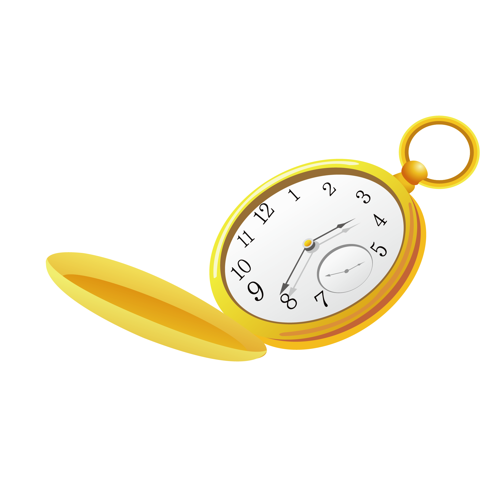

# 

#  goldwatch

A small tool to give an overview of Gold being gained and transported within a CMaNGOS server.

This is a work-in-progress, see the list below the current status, features and overall progress.

:heavy_check_mark: Done​ :x: Not done​

## MVP features

* :white_check_mark: Saving of 'player-snapshots' in order to track changes.
* :white_check_mark: Overview of mail-gold transactions
* :x: Overview of gold changes within the characters table.
* :x: Alerts of uncommon transactions
* :x: Configurable threshold defining uncommon gold-related behaviour.
